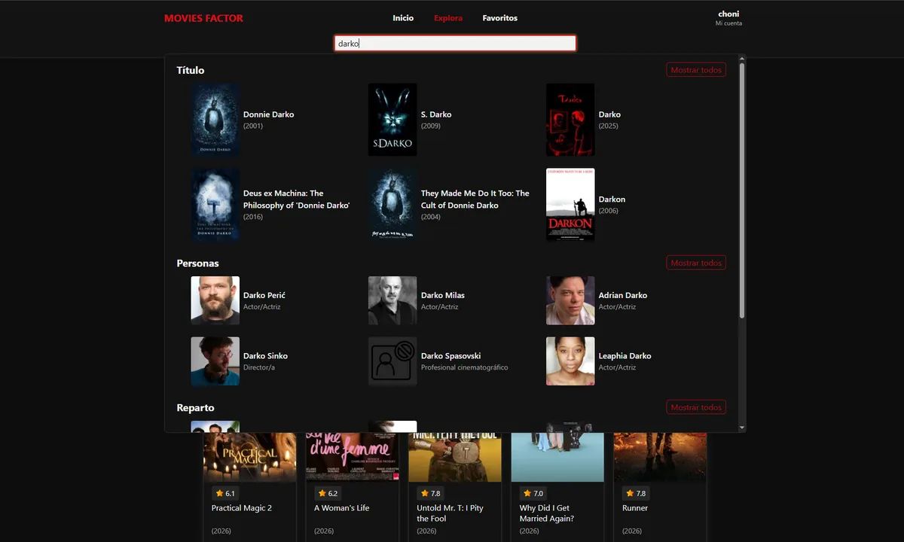
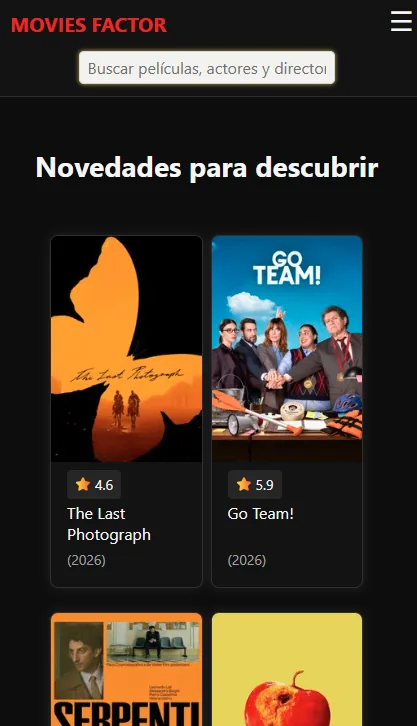
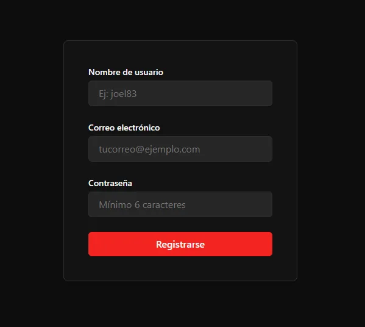
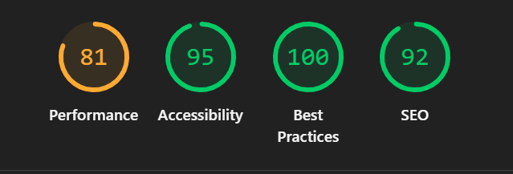

# Movies Factor — TMDB Movie Explorer & Personal Ratings Platform
 
An interactive web platform to explore, rate and manage favorite movies, built on top of the TMDB API with Firebase Authentication and a custom backend for personal ratings and favorites.
 
This is an academic project developed as part of a full-stack bootcamp, following an agile methodology (Epic → User Story → GitHub branch → Technical card) tracked via Trello and organized with Gitflow.
 
## Features
 
- Real-time, paginated movie listing sourced live from the TMDB API
- Debounced search with grouped dropdown results (movies, people, cast) and a full search-results page
- Movie detail pages with hero, synopsis, genres, cast, director and trailer
- User registration and login with Firebase Authentication (email/password)
- Session-aware navigation: an account dropdown menu with "Mi cuenta" and logout, closing on outside click, `Escape`, or after a successful logout
- Protected routes for authenticated-only sections, with redirect back to the originally requested page after login
- Mobile-first, accessible design: ARIA roles, `aria-live`, `aria-expanded`, keyboard navigation and focus management throughout
- Custom CSS token-based design system (CSS Modules, no UI framework)
> **Project status:** Epics 1 and 2 (movie discovery, search, movie detail) and most of Epic 3 (registration, login, logout) are complete and merged into `main`. Person detail pages (US-07/US-08) are pending. "Mi cuenta" is currently a placeholder screen for this MVP — profile editing, favorites and personal ratings (Epics 3–5) are the next stories to be implemented, together with the custom backend.
 
## Screenshots
 
| Home — Search | Home — "Novedades para descubrir" | Register |
| --- | --- | --- |
|  |  |  |
 
> More screenshots (movie detail, login, account dropdown) will be added here as they're captured.
 
## Lighthouse
 

 
## Live Demo
 
> **[joel-gandalf.github.io/S5_Movies](https://joel-gandalf.github.io/S5_Movies/)**
 
## Tech Stack
 
### Frontend
 
- [React 19](https://react.dev/) — UI library
- [TypeScript](https://www.typescriptlang.org/) — static typing
- [Vite](https://vite.dev/) — build tool
- [React Router v7](https://reactrouter.com/) (Declarative mode) — routing
- [React Hook Form](https://react-hook-form.com/) — form handling and validation
- [Firebase Authentication](https://firebase.google.com/docs/auth) — email/password sign-in
- CSS Modules — component-scoped styling, custom design tokens
- [Vitest](https://vitest.dev/) + [React Testing Library](https://testing-library.com/react) — testing
- [ESLint](https://eslint.org/) + [Prettier](https://prettier.io/) — linting and code formatting
### Backend (planned)
 
- [Node.js](https://nodejs.org/) + [Express](https://expressjs.com/) + TypeScript
- [MongoDB](https://www.mongodb.com/) + [Mongoose](https://mongoosejs.com/)
- Firebase Admin SDK — token verification
### External API
 
- [TMDB API](https://developer.themoviedb.org/docs) (v4 Bearer Token) — movie, cast and crew data
## Project Structure
 
```
S5_Movies/
├── frontend/
│   ├── public/
│   ├── src/
│   │   ├── assets/         # Images and icons
│   │   ├── components/     # Reusable UI components
│   │   ├── config/         # Static content, error messages and client-side config
│   │   ├── context/        # React contexts (e.g. AuthContext)
│   │   ├── hooks/          # Custom hooks
│   │   ├── pages/          # Page-level components, one per route
│   │   ├── routes/         # Route configuration and route guards
│   │   ├── services/       # Functions consuming TMDB / Firebase / the backend
│   │   ├── styles/         # CSS Modules and design tokens
│   │   ├── types/          # Shared TypeScript types and interfaces
│   │   ├── utils/          # Pure, reusable helper functions
│   │   └── main.tsx
│   ├── .env.example
│   ├── .env                # gitignored — see note below
│   ├── package.json
│   └── vite.config.ts
├── backend/                 # planned — not yet implemented
└── .gitignore
```
 
> `.env` is listed above for context but is **not** committed to the repository — it's excluded via `.gitignore` because it holds real API keys and Firebase credentials. `.env.example` is the version-controlled template: it lists every variable the app needs, with empty values, so anyone cloning the project knows exactly what to fill in without ever exposing real secrets.
 
## Getting Started
 
### Prerequisites
 
- Node.js (LTS recommended)
- npm
- A TMDB account with an API Read Access Token (v4)
- A Firebase project with the Email/Password sign-in provider enabled
> A live, hosted version of this project (no local installation required) is planned via GitHub Actions and will be linked in the [Live Demo](#live-demo) section above once set up. Until then, running the project locally is the only way to try it.
 
### Installation
 
Clone the repository and install the frontend dependencies:
 
```bash
git clone https://github.com/Joel-Gandalf/S5_Movies.git
cd S5_Movies/frontend
npm install
```
 
### Environment variables
 
Create a `.env` file inside `/frontend` based on `.env.example`:
 
```bash
cp .env.example .env
```
 
Fill in the following variables:
 
| Variable | Description |
| --- | --- |
| `VITE_TMDB_API_KEY` | TMDB API Read Access Token (v4 Bearer Token) |
| `VITE_FIREBASE_API_KEY` | Firebase Web SDK API key |
| `VITE_FIREBASE_AUTH_DOMAIN` | Firebase Auth domain |
| `VITE_FIREBASE_PROJECT_ID` | Firebase project ID |
| `VITE_FIREBASE_STORAGE_BUCKET` | Firebase storage bucket |
| `VITE_FIREBASE_MESSAGING_SENDER_ID` | Firebase Cloud Messaging sender ID |
| `VITE_FIREBASE_APP_ID` | Firebase app ID |
 
> These credentials can be obtained from the [TMDB API settings](https://www.themoviedb.org/settings/api) and the [Firebase console](https://console.firebase.google.com/), under your project's Web app configuration.
 
### Running the project
 
```bash
npm run dev
```
 
The app will be available at `http://localhost:5173` by default.
 
## Scripts
 
| Script | Description |
|--------|-------------|
| `npm run dev` | Start the development server |
| `npm run build` | Type-check and build the app for production |
| `npm run preview` | Preview the production build locally |
| `npm run lint` | Run ESLint over the project |
| `npm run format` | Format the codebase with Prettier |
| `npm run format:check` | Check formatting without writing changes |
| `npm test` | Run tests |
 
## Usage
 
- Browse the movie listing on **Explore**, with pagination
- Use the **search bar** to find movies, people or cast members, grouped in a dropdown, or view the full results page
- Open a movie's **detail page** to see its synopsis, genres, cast, director and trailer
- **Register** or **log in** to unlock authenticated-only sections; if you try to reach a protected page without a session, you're redirected to log in and sent back there afterward
- Once logged in, use the **account dropdown** (your username, in the navbar) to go to "Mi cuenta" or **log out**
## Next Steps
 
- US-05: multi-genre filtering on the movie listing (deferred)
- US-07 / US-08: actor and director detail pages
- US-12 (part 1): profile editing from "Mi cuenta" (currently a placeholder)
- Backend setup: Node.js + Express + MongoDB for personal ratings and favorites
- US-13: mark/unmark a movie as favorite
- US-14: rate a movie (1–10), with edit and delete
- US-12 (part 2) / US-15: personal ratings and favorites list screens
- US-16: community average rating shown on the movie detail page
## Organization for development management
 
[Link to the project Kanban board](https://trello.com/b/R7P6PqOU/proyecto-movies-tmdb)
 
## Author
 
**Joel Gandalf**
[GitHub](https://github.com/Joel-Gandalf)